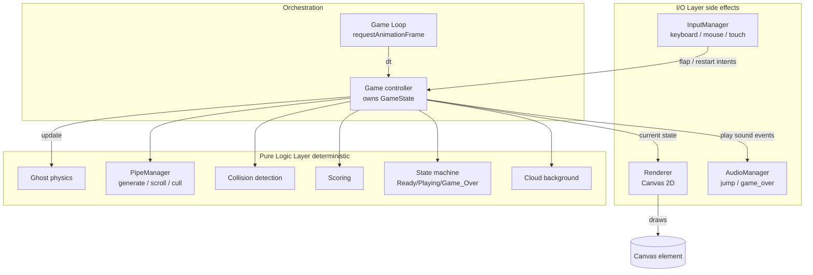
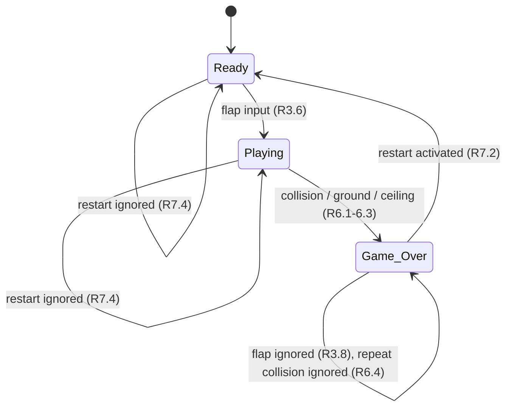

# Design Document

## Overview

Flappy Kiro is a lightweight, browser-based retro arcade game built with HTML5 Canvas and vanilla JavaScript (ES modules). There is no backend: the game runs by opening `index.html` directly or serving the folder with any static file server. The player guides a white ghost sprite through an endless stream of green pipe pairs; gravity pulls the ghost down and flap input (spacebar, mouse click, or touch) pushes it up. Passing a pipe pair scores a point. Colliding with a pipe, the ground, or the ceiling ends the game.

The core design principle is a strict separation between **pure game logic** (physics, pipe generation, collision, scoring, state transitions) and **side-effecting concerns** (canvas rendering, audio playback, DOM input binding). This separation keeps the game loop simple and, critically, makes the logic layer deterministic and testable — the correctness properties in this document target that pure layer directly, feeding it fixed inputs rather than relying on a live browser.

### Technology Choices and Rationale

| Decision | Choice | Rationale |
| --- | --- | --- |
| Rendering | HTML5 Canvas 2D context | Immediate-mode drawing is ideal for a per-frame redraw loop; no DOM-node churn. |
| Language | Vanilla JS, ES modules (`<script type="module">`) | No build step required; file can be opened or statically served. Keeps the game lightweight (Req: retro, no heavy frameworks). |
| Loop | `requestAnimationFrame` | Browser-synced frame pacing, auto-pauses on hidden tabs. |
| Physics timing | Per-frame integer-frame units | Requirements 2.1–2.3 specify "per frame" units, so the simulation is frame-based. A fixed-timestep accumulator smooths variable frame rates (see Architecture). |
| Testing | Node + a property-based testing library (fast-check) on the pure logic modules | Logic modules import nothing browser-specific, so they run under Node for property tests. |
| Dev tuning | lil-gui (toggleable, dev-only) | Live, range-clamped sliders for fast playtesting; tiny, no build step; disabled/hidden by default so it does not affect gameplay. |

### Requirements Addressed

This design covers all seven requirements: rendering and visuals (R1), gravity/physics (R2), flap input (R3), pipe generation and scrolling (R4), scoring (R5), collision and game over (R6), and restart (R7).

## Architecture

### High-Level Structure

The application is organized into three layers:

1. **Pure logic layer** — deterministic modules with no browser dependencies. Given a game state and inputs, they return a new/updated state. These are unit- and property-tested in isolation.
2. **I/O layer** — the renderer (Canvas), audio manager (Web Audio / `Audio`), and input manager (DOM events). These translate between the browser and the logic layer.
3. **Orchestration layer** — the game loop and the top-level `Game` object that owns the state, wires the layers together, and drives the fixed-timestep update.



### Game Loop and Fixed Timestep

Requirements 2.1–2.3 and 4.1 express motion in two different units: physics is "per frame" while pipe speed is "pixels per second". To honor the per-frame physics contract consistently across machines with different refresh rates, the loop uses a **fixed-timestep accumulator** with a logical frame rate of 60 updates per second:

```
const FIXED_DT = 1 / 60;        // seconds per logical frame
let accumulator = 0;
let last = performance.now();

function frame(now) {
    const elapsed = Math.min((now - last) / 1000, 0.25); // clamp to avoid spiral-of-death
    last = now;
    accumulator += elapsed;
    while (accumulator >= FIXED_DT) {
        game.update(FIXED_DT);   // one logical frame
        accumulator -= FIXED_DT;
    }
    game.render();               // draw once per animation frame
    requestAnimationFrame(frame);
}
```

Each `game.update(FIXED_DT)` call is "one frame" for the purposes of gravity and velocity integration (R2). Pipe horizontal movement (R4.1), expressed in pixels/second, is computed as `speed_px_per_sec * FIXED_DT` per logical frame, which is mathematically equivalent to per-second motion. Clamping `elapsed` prevents a long pause (e.g., a backgrounded tab) from producing a huge catch-up burst.

### State Machine

`Game_State` is one of `Ready`, `Playing`, `Game_Over`. Transitions:



Each state constrains what updates run:

- **Ready** — ghost held at vertical center with zero velocity (R2.4); no pipes exist; clouds drift; score shown as 0. Flap input transitions to Playing and applies the first flap (R3.6).
- **Playing** — gravity, ghost integration, pipe generation/scroll/cull, collision checks, scoring, cloud drift all run.
- **Game_Over** — pipes frozen (R6.6), ghost vertical movement stopped (R6.7), final score retained (R5.5, R6.9), game-over message and restart control shown (R6.8, R7.1). Flap input ignored (R3.8).

### File Layout

```
flappy-kiro/
  index.html              # canvas element + module entry
  src/
    main.js               # bootstrap: construct Game, start loop
    game.js               # Game controller + loop + FSM orchestration
    constants.js          # tunable config (gravity, speeds, sizes...)
    logic/
      physics.js          # applyGravity, integrate, flap, clampCeiling (pure)
      pipes.js            # PipeManager: generate, scroll, cull (pure)
      collision.js        # aabbIntersects, checkCollisions (pure)
      scoring.js          # updateScore (pure)
      clouds.js           # cloud drift update (pure)
      rng.js              # seedable RNG wrapper (pure, injectable)
    io/
      renderer.js         # Canvas drawing, layering, sprite fallback
      audio.js            # AudioManager, load-failure tolerant
      input.js            # InputManager: keyboard/mouse/touch -> intents
      tuning.js           # dev tuning panel (lil-gui), range-clamped
  assets/                 # ghosty.png, jump.wav, game_over.wav (existing)
  test/                   # property + unit tests
```

## Components and Interfaces

### Game Controller (`game.js`)

Owns the authoritative `GameState` and orchestrates each logical frame. It does not itself compute physics or collisions; it calls the pure modules and applies their results.

```
class Game {
  constructor({ renderer, audio, input, rng, config })
  update(dt)        // advance one logical frame based on current Game_State
  render()          // delegate to renderer with current state
  handleFlap()      // route flap intent per state (R3.6, R3.8)
  handleRestart()   // route restart intent per state (R7.2, R7.4)
}
```

`update(dt)` dispatches on `state.mode`:
- `Playing`: apply gravity → integrate position → clamp ceiling → scroll/generate/cull pipes → score → detect collisions → maybe transition to Game_Over.
- `Ready` / `Game_Over`: only cloud drift advances (plus Game_Over keeps everything frozen).

### Ghost Physics (`logic/physics.js`) — pure

```
applyGravity(ghost, config) -> ghost'      // v += gravity, clamp to terminalVelocity (R2.1, R2.2)
integrate(ghost) -> ghost'                 // y += v (R2.3)
flap(ghost, config) -> ghost'              // v = -flapImpulse (R3.1-R3.4)
clampCeiling(ghost) -> ghost'              // if y <= ceiling: y = ceiling, v = 0 (R2.5)
startPosition(config) -> ghost             // vertical center, v = 0 (R2.4)
```

All functions take a ghost snapshot and return a new one; no mutation of shared state, which keeps them trivially testable.

### Pipe Manager (`logic/pipes.js`) — pure

Holds the active list of pipe pairs and the x-position of the most recently generated pair.

```
scroll(pipes, speedPxPerSec, dt) -> pipes'      // x -= speed*dt (R4.1)
cull(pipes, canvasLeft) -> pipes'               // drop pairs fully past left edge (R4.3)
needsNewPipe(pipes, spacing, canvasRight) -> bool
generate(pipes, rng, config) -> pipes'          // append pair at spacing (R4.2, R4.4, R4.5)
```

`generate` positions the gap center so the gap top is >= 50px below ceiling and gap bottom is >= 50px above ground (R4.4), with gap height fixed in [100, 200] (R4.5, R1.5). The randomized center is derived from an injected `rng` so tests are deterministic.

### Collision Detection (`logic/collision.js`) — pure

```
aabbIntersects(a, b) -> bool                     // axis-aligned box overlap, >= 1px (R6.1)
hitsPipe(ghost, pipes) -> bool
hitsGround(ghost, ground) -> bool                // ghost bottom >= ground top (R6.2)
hitsCeiling(ghost, ceiling) -> bool              // ghost top <= ceiling (R6.3)
checkCollisions(ghost, pipes, bounds) -> bool    // any of the above
```

### Scoring (`logic/scoring.js`) — pure

```
updateScore(score, ghost, pipes) -> { score', pipes' }
```

For each pipe pair whose right edge the ghost has passed and that is not yet marked `scored`, increment the score by one and mark the pair `scored` (R5.2, R5.3). Score is capped at `MAX_SCORE = 999_999` (R5.6). Marking pairs rather than counting passes guarantees each pair counts at most once per session.

### Clouds (`logic/clouds.js`) — pure

```
driftClouds(clouds, dt) -> clouds'   // move left slowly; wrap/respawn off-screen
```

Clouds are purely decorative background state (R1.6); they do not interact with physics or collision.

### Renderer (`io/renderer.js`) — side-effecting

Draws one frame in strict back-to-front order to satisfy the layering requirement (R1.6, R1.2):

1. Sky-blue background fill, 100% of play area (R1.2).
2. Clouds (R1.6 — behind pipes and ghost).
3. Pipe pairs (green, R1.5).
4. Ghost sprite, or placeholder shape if sprite failed to load (R1.3, R1.4).
5. HUD: score (R1.7, R5.4); game-over message + restart control when in Game_Over (R6.8, R7.1).
6. Canvas border, 1–4px solid (R1.1) — drawn via CSS on the canvas element or as a final stroke.

The renderer receives the sprite-loaded flag and chooses sprite vs. placeholder accordingly.

### Audio Manager (`io/audio.js`) — side-effecting

```
class AudioManager {
  load()                 // preload jump + game_over; tolerate failures
  playJump()             // R3.5 (no-op if unavailable)
  playGameOver()         // R6.5, exactly once per transition
}
```

The Game_Over sound is triggered by the single `Playing -> Game_Over` transition in the controller, which structurally guarantees "exactly once" (R6.5).

### Input Manager (`io/input.js`) — side-effecting

Binds DOM events and converts them into two intents: **flap** and **restart (pointer activation of the restart control)**.

- `keydown` Space → flap intent, but only on the leading edge: a `keyup` must occur before the same hold produces another flap (R3.7). Tracked with a `spaceHeld` boolean.
- `mousedown`/`click` on canvas → flap intent (R3.2); if in Game_Over and the pointer is within the restart control bounds → restart intent (R7.1).
- `touchstart` on canvas → flap intent (R3.3), with `preventDefault` to suppress synthetic mouse events (avoids double-flap).

All three input kinds route to the same `handleFlap`, so the impulse magnitude is identical (R3.4).

## Data Models

### Configuration (`constants.js`)

Chosen values sit inside the ranges the requirements allow:

```
const config = {
  canvas:   { width: 384, height: 640, border: 2 },      // R1.1
  ground:   { y: 640 },                                   // ground = bottom boundary
  ceiling:  { y: 0 },                                     // ceiling = top boundary
  ghost:    { width: 34, height: 34 },                    // sprite box
  physics:  { gravity: 0.5, terminalVelocity: 10,         // R2.1, R2.2
              flapImpulse: 8 },                           // R3 upward impulse
  pipes:    { speedPxPerSec: 180, spacing: 300,           // R4.1, R4.2
              gapHeight: 150, width: 60, edgeMargin: 50 },// R4.5, R4.4
  score:    { max: 999999 },                              // R5.6
};
```

### Configuration and Tuning

Tunable values are managed through two complementary mechanisms: a centralized config that is the source of truth, and an optional live tuning panel for fast playtesting.

**a. Centralized config as source of truth.** `src/constants.js` exports a single `config` object grouped by category (`canvas`, `physics`, `pipes`, `score`, as shown above). This is the single place to define and edit default tunable values. Every module — pure logic and I/O alike — imports its values from this object; no magic numbers are scattered through the logic. Because the pure logic modules receive `config` as an injected parameter (see Components and Interfaces), editing one object cascades consistently through the whole game, and tests can inject their own config without touching globals.

**b. Live tuning panel.** A toggleable, in-browser debug GUI (built with **lil-gui**, a tiny dependency loaded via CDN / ES module import, consistent with the no-build vanilla-JS approach) exposes sliders for the key tunables: `gravity`, `terminalVelocity`, `flapImpulse`, pipe `speedPxPerSec`, `spacing`, `gapHeight`, and pipe `width`. The panel reads its initial values from the `config` object and writes changes back into the same object live, so adjustments take effect on the next frame with no page reload. It is toggled with a key (the backtick `` ` ``) and is **hidden by default**: it is purely a development aid and has no effect on gameplay logic when closed.

Design constraints:

- **Range-clamped sliders.** Each slider is clamped to the valid range defined by the requirements so tuning can never violate the spec. The slider min/max bounds are:

  | Tunable | Min | Max | Requirement |
  | --- | --- | --- | --- |
  | canvas width | 288 | 512 | R1.1 |
  | canvas height | 480 | 768 | R1.1 |
  | border | 1 | 4 | R1.1 |
  | gap height | 100 | 200 | R1.5 / R4.5 |
  | gravity | 0.1 | 1.0 | R2.1 |
  | terminalVelocity | 5 | 20 | R2.2 |
  | pipe speedPxPerSec | 100 | 300 | R4.1 |
  | spacing | 200 | 400 | R4.2 |
  | gap edge margin | 50 | (unbounded above) | R4.4 |

- **Mid-game changes affect only future geometry.** Changing a value during play only affects subsequently generated pipes and subsequent frames; already-generated pipes keep their established geometry. This preserves the "each pipe scored at most once" invariant (Property 11) and the state-machine invariants (Properties 16–20) — no retroactive mutation of existing pipe pairs occurs.
- **Lives in the I/O layer.** The tuning panel is a side-effecting development/debug concern and lives in the I/O layer (`src/io/tuning.js`), **not** in the pure logic layer. The pure logic modules continue to receive `config` as an injected parameter, so the correctness properties and their tests are entirely unaffected by the panel's presence or absence.

### GameState

The single authoritative object the controller owns and the renderer reads:

```
GameState {
  mode: "Ready" | "Playing" | "Game_Over"   // Game_State (R1.3, FSM)
  ghost: Ghost
  pipes: PipePair[]
  clouds: Cloud[]
  score: number        // non-negative integer, 0..999999 (R5.1, R5.6)
  gameOverSoundPlayed: boolean  // guards R6.5
}
```

### Ghost

```
Ghost {
  x: number            // fixed horizontal position
  y: number            // vertical position (R2.3, R2.4)
  vy: number           // vertical velocity, px/frame (R2.1-R2.3)
  width: number
  height: number
}
```

The ghost's bounding box is `{ left: x, top: y, right: x+width, bottom: y+height }` for collision (R6.1–R6.3).

### PipePair

```
PipePair {
  x: number            // left edge, scrolls right-to-left (R4.1)
  width: number
  gapTop: number       // y of gap top (>= ceiling + 50) (R4.4)
  gapBottom: number    // gapTop + gapHeight (R4.5); gapBottom <= ground - 50
  scored: boolean      // true once counted (R5.3)
}
```

Top pipe box: `{ left: x, top: ceiling, right: x+width, bottom: gapTop }`.
Bottom pipe box: `{ left: x, top: gapBottom, right: x+width, bottom: ground }`.

### Cloud

```
Cloud {
  x: number
  y: number
  speed: number        // slow leftward drift (R1.6)
  scale: number
}
```

### RNG (`logic/rng.js`)

A seedable pseudo-random generator (e.g., mulberry32) exposing `next() -> [0,1)`. Injected into `PipeManager.generate` so pipe-generation tests are reproducible while production uses a time-seeded instance.

## Correctness Properties

*A property is a characteristic or behavior that should hold true across all valid executions of a system — essentially, a formal statement about what the system should do. Properties serve as the bridge between human-readable specifications and machine-verifiable correctness guarantees.*

These properties target the pure logic layer (`src/logic/*` and the controller's state-transition routing). Rendering, audio playback timing, and input-event binding are verified by example/unit and mock-based tests described in the Testing Strategy rather than by property tests, because they are side-effecting UI concerns whose behavior does not vary meaningfully with generated input.

### Property 1: Gravity integration increments velocity and respects terminal cap

*For any* ghost with any vertical velocity, applying gravity for one frame while Playing increases the vertical velocity by exactly the configured gravity acceleration when the result is below terminal velocity, and never produces a vertical velocity greater than the configured terminal velocity.

**Validates: Requirements 2.1, 2.2**

### Property 2: Position integration adds velocity

*For any* ghost, integrating one frame produces a new vertical position equal to the previous position plus the current vertical velocity.

**Validates: Requirements 2.3**

### Property 3: Ceiling clamp pins position and zeroes velocity

*For any* ghost whose top edge is at or above the ceiling, the ceiling clamp sets the ghost's top edge exactly to the ceiling boundary and sets its vertical velocity to zero.

**Validates: Requirements 2.5**

### Property 4: Flap applies a fixed upward impulse independent of input source

*For any* ghost, a flap sets the vertical velocity to the single fixed upward impulse value, regardless of its previous velocity and regardless of whether the flap originated from spacebar, mouse click, or touch tap.

**Validates: Requirements 3.1, 3.2, 3.3, 3.4**

### Property 5: Flap in Ready transitions to Playing with the first flap applied

*For any* game in the Ready state, processing a flap intent transitions the state to Playing and sets the ghost's vertical velocity to the fixed upward impulse.

**Validates: Requirements 3.6**

### Property 6: Held spacebar yields at most one flap per press

*For any* sequence of spacebar keydown events with no intervening keyup, the input manager emits at most one flap intent; a flap intent becomes available again only after a keyup is observed.

**Validates: Requirements 3.7**

### Property 7: Pipes scroll leftward at the configured speed

*For any* set of pipe pairs and any frame delta, scrolling moves every pipe pair's horizontal position left by exactly the configured speed multiplied by the frame delta, and no pipe moves rightward.

**Validates: Requirements 4.1**

### Property 8: New pipes are generated at fixed spacing

*For any* non-empty set of generated pipe pairs, a newly generated pipe pair is positioned exactly the configured spacing distance to the right of the most recently generated pair.

**Validates: Requirements 4.2**

### Property 9: Pipes fully past the left edge are culled, others retained

*For any* set of pipe pairs, culling removes exactly those pairs whose right edge is at or beyond the canvas left boundary and retains all pairs whose right edge is still inside the canvas.

**Validates: Requirements 4.3**

### Property 10: Generated gap is within bounds and has the fixed gap height

*For any* random value in [0, 1), a newly generated pipe pair has a gap top at least the edge margin below the ceiling, a gap bottom at least the edge margin above the ground, and a gap height equal to the configured value in the range 100 to 200 pixels.

**Validates: Requirements 4.4, 4.5, 1.5**

### Property 11: Each pipe pair is scored exactly once after being passed

*For any* set of pipe pairs and ghost position, repeatedly updating the score increments the score by exactly one for each pair the ghost has passed (ghost's horizontal position beyond the pair's right edge) and never increments again for an already-scored pair; the resulting score is always a non-negative integer.

**Validates: Requirements 5.2, 5.3, 1.7**

### Property 12: Score never exceeds the maximum cap

*For any* game state, updating the score never produces a score greater than 999,999.

**Validates: Requirements 5.6**

### Property 13: Axis-aligned bounding boxes detect at least one pixel of overlap

*For any* two bounding boxes, the collision test returns true if and only if the boxes overlap by at least one pixel on both axes.

**Validates: Requirements 6.1**

### Property 14: Ground contact is detected

*For any* ghost whose bottom edge is at or beyond the top of the ground, the ground-collision test returns true.

**Validates: Requirements 6.2**

### Property 15: Ceiling contact is detected

*For any* ghost whose top edge is at or above the ceiling, the ceiling-collision test returns true.

**Validates: Requirements 6.3**

### Property 16: Any collision while Playing transitions to Game_Over

*For any* Playing game in which the ghost's bounding box overlaps a pipe, or the ghost reaches the ground, or the ghost reaches the ceiling, updating one frame transitions the state to Game_Over.

**Validates: Requirements 6.1, 6.2, 6.3**

### Property 17: Game_Over sound plays exactly once per transition

*For any* sequence of frame updates that enters the Game_Over state exactly once, the Game_Over sound is played exactly one time.

**Validates: Requirements 6.5**

### Property 18: Game_Over is a frozen, idempotent state

*For any* game already in the Game_Over state, updating one or more frames leaves the state mode, the score, the ghost's vertical position and velocity, and every pipe pair's position unchanged, and does not re-trigger the Game_Over effects.

**Validates: Requirements 5.5, 6.4, 6.6, 6.7, 3.8**

### Property 19: Restart from Game_Over resets to a clean Ready state

*For any* game in the Game_Over state, activating restart sets the score to zero, repositions the ghost to the starting position with zero velocity, removes all active pipe pairs, and sets the state to Ready.

**Validates: Requirements 7.2, 7.3, 5.1**

### Property 20: Restart outside Game_Over is ignored

*For any* game in the Ready or Playing state, activating restart leaves the state mode, score, ghost, and active pipe pairs unchanged.

**Validates: Requirements 7.4**

## Error Handling

The game is a self-contained client app with no network calls, so error handling focuses on asset loading and runtime robustness so a single failure never halts the game loop.

### Sprite Load Failure (R1.4)

The ghost sprite is loaded via an `Image` with `onload`/`onerror` handlers. A `spriteLoaded` boolean defaults to `false` and flips to `true` only on successful load. The renderer checks this flag each frame:

- Loaded → draw `assets/ghosty.png` at the ghost's bounding box.
- Not loaded (still loading or failed) → draw a solid-colored placeholder rectangle of identical width and height at the ghost position.

The game loop starts immediately regardless of sprite status, so a failed or slow sprite load never blocks gameplay. This satisfies R1.4's "continue rendering without halting."

### Audio Load / Playback Failure (R3.5, R6.5)

Each sound is wrapped in an `Audio` object (or decoded buffer). The `AudioManager`:

- Guards each `play()` in a try/catch and treats a rejected play promise or missing buffer as a no-op.
- Tolerates browsers that block autoplay until first user gesture — since the first flap is a user gesture, audio is effectively unlocked by the time Playing begins.
- Keeps a `loaded` flag per sound; if a sound failed to load, its play method returns immediately.

Audio failure degrades gracefully to a silent game; it never throws into the game loop.

### Tuning Panel Load Failure

The tuning panel is a dev-only aid. If the lil-gui library fails to load (e.g., CDN unreachable), the game continues normally without the panel — construction of the panel is guarded so a load failure degrades gracefully to "no panel," and the game loop is never blocked.

### Game Loop Robustness

- The frame delta is clamped (`Math.min(elapsed, 0.25)`) to prevent a backgrounded tab from producing a massive catch-up burst that would tunnel the ghost through pipes.
- `update` and `render` are the only per-frame work; an exception in rendering is caught at the loop boundary and logged, allowing the next frame to proceed rather than killing `requestAnimationFrame`.

### Invalid / Edge Inputs

- Input handlers ignore events that do not correspond to a valid intent for the current state (e.g., flap in Game_Over per R3.8, restart in Ready/Playing per R7.4) rather than erroring.
- Touch handlers call `preventDefault` to avoid duplicate synthetic mouse events producing a double flap.

## Testing Strategy

The strategy combines property-based tests over the pure logic layer with example/unit and mock-based tests over the I/O layer.

### Dual Testing Approach

- **Property tests** verify the universal properties above across many generated inputs. They target `src/logic/*` and the controller's pure state-transition routing (`handleFlap`, `handleRestart`, `update` dispatch), which import nothing browser-specific and therefore run under Node.
- **Unit / example tests** verify specific scenarios, configuration bounds, edge cases, and error branches.
- **Mock-based tests** verify side effects (audio played, correct draw order) by injecting fake renderer/audio objects.

### Property-Based Testing

- Library: **fast-check** (JavaScript property-based testing). We will not implement property testing from scratch.
- Each property above is implemented as a **single** fast-check property.
- Each property test runs a **minimum of 100 iterations** (fast-check `numRuns: 100` or higher).
- Generators produce valid-but-varied inputs: ghosts with random position/velocity, pipe lists of random length and positions, random RNG values in [0, 1), and random frame deltas within a sane range.
- Each property test is tagged with a comment referencing its design property, in the format:
  `// Feature: flappy-kiro, Property {number}: {property_text}`
- Determinism: the seedable RNG is injected so pipe-generation properties (Property 10) are reproducible; failures report the fast-check counterexample.

Mapping of properties to logic modules under test:

| Properties | Module(s) |
| --- | --- |
| 1, 2, 3, 4 | `logic/physics.js` |
| 5, 16, 17, 18, 19, 20 | `game.js` (state transitions, orchestration with mocks) |
| 6 | `io/input.js` (edge-trigger logic, extracted as a pure helper) |
| 7, 8, 9, 10 | `logic/pipes.js` |
| 11, 12 | `logic/scoring.js` |
| 13, 14, 15 | `logic/collision.js` |

### Unit / Example Tests

- Canvas config values fall within required ranges (R1.1, R1.5): width 288–512, height 480–768, border 1–4, gap 100–200.
- `startPosition` returns the vertical center with zero velocity (R2.4).
- Initial and post-restart score is zero (R5.1).
- Sprite-fallback: with `spriteLoaded = false`, the renderer draws a placeholder of equal dimensions and does not throw (R1.4).
- Renderer draw order: background → clouds → pipes → ghost → HUD, asserting clouds are drawn before pipes and ghost (R1.2, R1.6), and that the score (R1.7, R5.4) and, in Game_Over, the game-over message and restart control are drawn (R6.8, R7.1).

### Mock-Based / Integration Tests

- Flap in Playing calls `AudioManager.playJump` once (R3.5), using a mock that counts calls.
- Game_Over transition calls `AudioManager.playGameOver` exactly once across repeated updates (R6.5) — complements Property 17.
- Input routing: a click within the restart-control bounds in Game_Over produces a restart intent; a click elsewhere or in other states produces a flap intent (R7.1, R3.2); touch produces a single flap (R3.3).

### Manual / Smoke Verification

Open `index.html` (or serve the folder) and confirm the game is playable end to end: ghost falls and flaps, pipes scroll and generate endlessly, score increments once per pipe, collisions end the game with sound and a restart prompt, and restart returns to a clean Ready state. This covers display-timing criteria (R1.7, R5.4, R6.8) that are impractical to assert in automated unit tests.

The live tuning panel is excluded from property tests — it is a side-effecting dev/debug concern — and is verified only by manual/smoke checks (toggle with backtick, drag sliders, confirm the game responds and that a lil-gui load failure leaves the game playable). The config range-bound unit tests above already cover the valid ranges the sliders clamp to.
